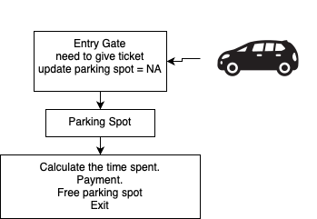

# Low level design of parking the vehicels

## Functional Requirements 
    1. Support parking for cars and bikes.
    2. Single level with multiple parking spots.
    3. Track available and occupied spots.
    4. Entry and exit management.
    5. Generate entry tickets with time.
    6. Calculate fees based on duration.
    7. Support payment processing.
    8. Handle lost tickets.
    9. Real-time updates on spot availability.

## Non Functional Requirement
    1. System should be highly available.
    2. Ensure data consistency.
    3. System should be scalable to handle more vehicles.
    4. Provide quick response times.
    5. Ensure security of payment information.
    6. Maintain user privacy.
    7. System should be maintainable and extensible.
    8. Provide reliable real-time updates.

