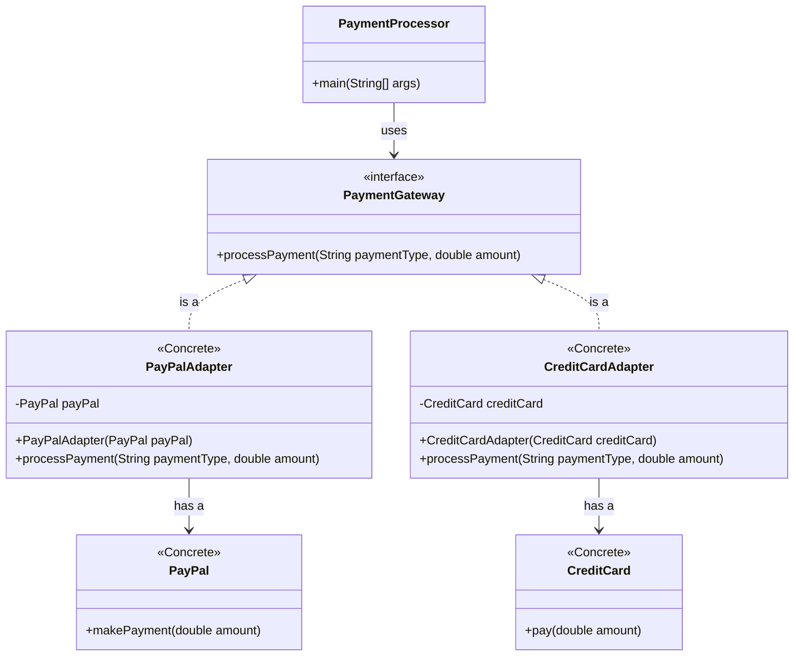

# Why
use the Adapter Design Pattern?

The Adapter Design Pattern allows incompatible interfaces to work together. It acts as a bridge between two incompatible interfaces, enabling them to communicate and work together without modifying their existing code. This pattern is particularly useful when integrating new components into an existing system or when working with legacy code.

## Real World Examples of Adapter Design Pattern

1. **Power Adapters**: Power adapters are used to convert the electrical output from one type to another, allowing devices from different countries with different plug types and voltages to be used together.

2. **USB to Ethernet Adapters**: These adapters allow devices that only have USB ports to connect to an Ethernet network, enabling internet access for devices without built-in Ethernet ports.

3. **Media Players**: Media players often use adapters to play different types of media files. For example, a media player might use an adapter to play both MP3 and WAV files, even though they have different formats.

4. **Database Drivers**: Database drivers act as adapters between an application and a database. They allow the application to interact with different types of databases (e.g., MySQL, PostgreSQL) using a common interface.

5. **Payment Gateways**: Payment gateways often use adapters to integrate with various payment methods (e.g., credit cards, PayPal, Apple Pay). The adapter allows the e-commerce platform to process payments through different providers without changing its core code.


## Step-by-Step Code for Adapter Design Pattern in Java for Payment Gateway

### Step 1: Define the Target Interface
```java
// PaymentGateway.java
public interface PaymentGateway {
    void processPayment(String paymentType, double amount);
}
```

### Step 2: Implement the Adaptee Classes
```java
// PayPal.java
public class PayPal {
    public void makePayment(double amount) {
        System.out.println("Processing payment of $" + amount + " through PayPal.");
    }
}

// CreditCard.java
public class CreditCard {
    public void pay(double amount) {
        System.out.println("Processing payment of $" + amount + " through Credit Card.");
    }
}
```

### Step 3: Create the Adapter Classes
```java
// PayPalAdapter.java
public class PayPalAdapter implements PaymentGateway {
    private PayPal payPal;

    public PayPalAdapter(PayPal payPal) {
        this.payPal = payPal;
    }

    @Override
    public void processPayment(String paymentType, double amount) {
        payPal.makePayment(amount);
    }
}

// CreditCardAdapter.java
public class CreditCardAdapter implements PaymentGateway {
    private CreditCard creditCard;

    public CreditCardAdapter(CreditCard creditCard) {
        this.creditCard = creditCard;
    }

    @Override
    public void processPayment(String paymentType, double amount) {
        creditCard.pay(amount);
    }
}
```

### Step 4: Use the Adapter in the Client Code
```java
// PaymentProcessor.java
public class PaymentProcessor {
    public static void main(String[] args) {
        PaymentGateway payPalAdapter = new PayPalAdapter(new PayPal());
        PaymentGateway creditCardAdapter = new CreditCardAdapter(new CreditCard());

        payPalAdapter.processPayment("PayPal", 100.0);
        creditCardAdapter.processPayment("Credit Card", 200.0);
    }
}
```


## Class Diagram for Adapter Design Pattern Example


