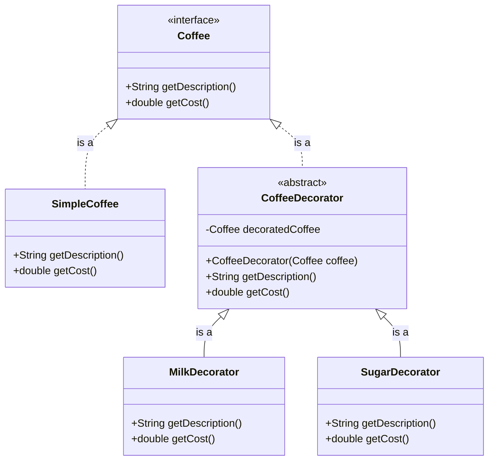

# Why Use the Decorator Design Pattern?

The Decorator Design Pattern is used to extend the functionalities of objects in a flexible and reusable way. Here are some reasons to use it:

1. **Single Responsibility Principle**: It allows functionality to be divided between classes with unique areas of concern.
2. **Open/Closed Principle**: Objects can be extended to include new behavior without modifying existing code.
3. **Flexible Alternatives**: It provides a flexible alternative to subclassing for extending functionality.
4. **Runtime Behavior**: New functionalities can be added to objects at runtime.

Here is a simple example in Java:

```java
// Component Interface
public interface Coffee {
    String getDescription();
    double getCost();
}

// Concrete Component
public class SimpleCoffee implements Coffee {
    public String getDescription() {
        return "Simple coffee";
    }

    public double getCost() {
        return 5.0;
    }
}

// Decorator Class
public abstract class CoffeeDecorator implements Coffee {
    protected Coffee decoratedCoffee;

    public CoffeeDecorator(Coffee coffee) {
        this.decoratedCoffee = coffee;
    }

    public String getDescription() {
        return decoratedCoffee.getDescription();
    }

    public double getCost() {
        return decoratedCoffee.getCost();
    }
}

// Concrete Decorators
public class MilkDecorator extends CoffeeDecorator {
    public MilkDecorator(Coffee coffee) {
        super(coffee);
    }

    public String getDescription() {
        return decoratedCoffee.getDescription() + ", milk";
    }

    public double getCost() {
        return decoratedCoffee.getCost() + 1.5;
    }
}

public class SugarDecorator extends CoffeeDecorator {
    public SugarDecorator(Coffee coffee) {
        super(coffee);
    }

    public String getDescription() {
        return decoratedCoffee.getDescription() + ", sugar";
    }

    public double getCost() {
        return decoratedCoffee.getCost() + 0.5;
    }
}

// Usage
public class Main {
    public static void main(String[] args) {
        Coffee coffee = new SimpleCoffee();
        System.out.println(coffee.getDescription() + " $" + coffee.getCost());

        coffee = new MilkDecorator(coffee);
        System.out.println(coffee.getDescription() + " $" + coffee.getCost());

        coffee = new SugarDecorator(coffee);
        System.out.println(coffee.getDescription() + " $" + coffee.getCost());
    }
}
```
# Class diagram

