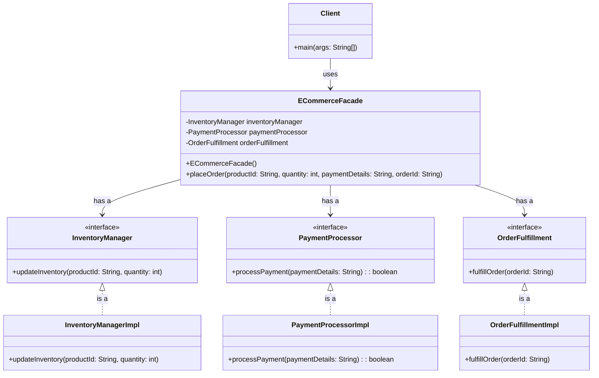

# Why

The Facade design pattern is used to provide a simplified interface to a complex subsystem. It helps in:

- Reducing complexity by hiding the intricate details of the subsystem.
- Improving code readability and usability.
- Decoupling the client code from the subsystem, making the system easier to maintain and extend.
- Promoting loose coupling between subsystems.

By using the Facade pattern, you can make your code more modular and easier to work with.

## Real World Examples

Here are five real-world examples where the Facade design pattern can be effectively used:

1. **Home Theater System**: A home theater system consists of various components like a DVD player, projector, sound system, and lights. A Facade can provide a simple interface to control all these components together, such as turning on the system, playing a movie, and adjusting the lights.

2. **Travel Booking System**: Booking a trip involves multiple subsystems like flight reservations, hotel bookings, and car rentals. A Facade can provide a unified interface to handle all these bookings through a single interface, simplifying the process for the user.

3. **E-commerce Platform**: An e-commerce platform may have various subsystems like inventory management, payment processing, and order fulfillment. A Facade can offer a simplified interface to manage these subsystems, making it easier for developers to integrate and manage the platform.

4. **Banking System**: In a banking system, there are multiple services like account management, loan processing, and transaction handling. A Facade can provide a unified interface to interact with these services, making it easier for clients to perform banking operations.

5. **Computer Startup Process**: Starting a computer involves several steps like powering up, loading the operating system, and initializing hardware components. A Facade can provide a simple interface to manage the startup process, hiding the complexity from the user.

By using the Facade pattern in these scenarios, you can simplify interactions with complex systems and improve overall usability.


## Step-by-Step Example: E-commerce Platform

Let's walk through a step-by-step example of how the Facade design pattern can be applied to an e-commerce platform.

### Step 1: Identify Subsystems

First, identify the subsystems involved in the e-commerce platform. For this example, we'll consider the following subsystems:
- Inventory Management
- Payment Processing
- Order Fulfillment

### Step 2: Create Subsystem Interfaces

Define interfaces for each subsystem to represent their functionalities.

```java
// Inventory Management Interface
public interface InventoryManager {
    void updateInventory(String productId, int quantity);
}

// Payment Processing Interface
public interface PaymentProcessor {
    boolean processPayment(String paymentDetails);
}

// Order Fulfillment Interface
public interface OrderFulfillment {
    void fulfillOrder(String orderId);
}
```

### Step 3: Implement Subsystems

Implement the subsystems based on the defined interfaces.

```java
// Inventory Management Implementation
public class InventoryManagerImpl implements InventoryManager {
    @Override
    public void updateInventory(String productId, int quantity) {
        // Logic to update inventory
        System.out.println("Inventory updated for product: " + productId);
    }
}

// Payment Processing Implementation
public class PaymentProcessorImpl implements PaymentProcessor {
    @Override
    public boolean processPayment(String paymentDetails) {
        // Logic to process payment
        System.out.println("Payment processed: " + paymentDetails);
        return true;
    }
}

// Order Fulfillment Implementation
public class OrderFulfillmentImpl implements OrderFulfillment {
    @Override
    public void fulfillOrder(String orderId) {
        // Logic to fulfill order
        System.out.println("Order fulfilled: " + orderId);
    }
}
```

### Step 4: Create the Facade

Create a Facade class that provides a simplified interface to interact with the subsystems.

```java
public class ECommerceFacade {
    private InventoryManager inventoryManager;
    private PaymentProcessor paymentProcessor;
    private OrderFulfillment orderFulfillment;

    public ECommerceFacade() {
        this.inventoryManager = new InventoryManagerImpl();
        this.paymentProcessor = new PaymentProcessorImpl();
        this.orderFulfillment = new OrderFulfillmentImpl();
    }

    public void placeOrder(String productId, int quantity, String paymentDetails, String orderId) {
        if (paymentProcessor.processPayment(paymentDetails)) {
            inventoryManager.updateInventory(productId, quantity);
            orderFulfillment.fulfillOrder(orderId);
            System.out.println("Order placed successfully!");
        } else {
            System.out.println("Payment failed. Order not placed.");
        }
    }
}
```

### Step 5: Use the Facade

Use the Facade to place an order without worrying about the complexities of the subsystems.

```java
public class Client {
    public static void main(String[] args) {
        ECommerceFacade eCommerceFacade = new ECommerceFacade();
        eCommerceFacade.placeOrder("product123", 2, "paymentDetails", "order123");
    }
}
```

By using the Facade pattern, the client code can place an order with a single method call, without needing to interact with the individual subsystems directly. This simplifies the code and makes it easier to maintain and extend.


## Class Diagram

Here is the class diagram for the e-commerce platform example using the Facade design pattern:



This class diagram illustrates the relationships between the Facade, subsystems, and client in the e-commerce platform example.