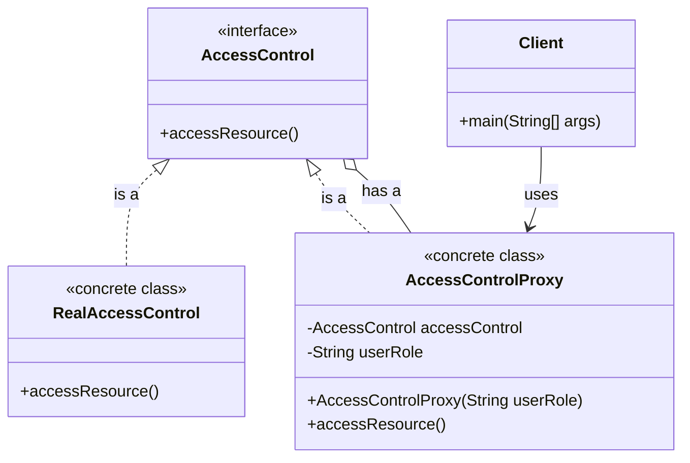

# Why
The Proxy Design Pattern is used to provide a surrogate or placeholder for another object to control access to it. This pattern is beneficial in several scenarios:

1. **Lazy Initialization**: Delay the creation and initialization of expensive objects until they are actually needed.
2. **Access Control**: Manage access to the original object, allowing only authorized clients to use it.
3. **Remote Proxy**: Represent an object that is located in a different address space, making it appear as if it is local.
4. **Logging and Monitoring**: Keep track of the operations performed on the original object for debugging or monitoring purposes.
5. **Caching**: Store the results of expensive operations and reuse them when the same inputs occur again.

By using a proxy, you can add an additional layer of control and optimization to your application.

## Real World Examples

1. **Virtual Proxy for Image Loading**: In a web application, images can be loaded lazily. A virtual proxy can display a placeholder image while the actual image is being loaded in the background.

2. **Security Proxy for Access Control**: In a banking application, a security proxy can ensure that only authenticated and authorized users can access sensitive operations like transferring funds.

3. **Remote Proxy for Network Communication**: In a distributed system, a remote proxy can represent an object located on a different server, allowing local code to interact with it as if it were local.

4. **Smart Reference Proxy for Resource Management**: In a file system, a smart reference proxy can manage file handles, ensuring that files are closed properly after operations are completed to avoid resource leaks.

5. **Cache Proxy for Performance Optimization**: In a web service, a cache proxy can store the results of expensive database queries and return cached results for repeated requests, reducing the load on the database and improving response times.

## Step-by-Step Guide for Access Control using Proxy Design Pattern

### Step 1: Define the Subject Interface
Create an interface that defines the operations that can be performed.

```java
public interface AccessControl {
    void accessResource();
}
```

### Step 2: Implement the Real Subject
Create a class that implements the `AccessControl` interface and provides the actual functionality.

```java
public class RealAccessControl implements AccessControl {
    @Override
    public void accessResource() {
        System.out.println("Accessing the resource...");
    }
}
```

### Step 3: Implement the Proxy
Create a proxy class that controls access to the real subject. The proxy checks if the user has the necessary permissions before allowing access.

```java
public class AccessControlProxy implements AccessControl {
    private AccessControl accessControl;
    private String userRole;

    public AccessControlProxy(String userRole) {
        this.accessControl = new RealAccessControl();
        this.userRole = userRole;
    }

    @Override
    public void accessResource() {
        if ("ADMIN".equalsIgnoreCase(userRole)) {
            accessControl.accessResource();
        } else {
            System.out.println("Access Denied: You do not have the necessary permissions.");
        }
    }
}
```

### Step 4: Client Code
Create a client class to test the proxy.

```java
public class Client {
    public static void main(String[] args) {
        AccessControl adminAccess = new AccessControlProxy("ADMIN");
        adminAccess.accessResource(); // Should print "Accessing the resource..."

        AccessControl userAccess = new AccessControlProxy("USER");
        userAccess.accessResource(); // Should print "Access Denied: You do not have the necessary permissions."
    }
}
```

### Summary
In this example, the `AccessControlProxy` class acts as a proxy to the `RealAccessControl` class. It checks the user's role before allowing access to the resource. This ensures that only users with the "ADMIN" role can access the resource, while others are denied access.


## Class Diagram

Below is the class diagram for the Access Control example using the Proxy Design Pattern:



In this diagram:
- `AccessControl` is the interface that defines the `accessResource` method.
- `RealAccessControl` is the concrete class that implements the `AccessControl` interface.
- `AccessControlProxy` is the proxy class that also implements the `AccessControl` interface and controls access to the `RealAccessControl` object.
- `Client` is the class that uses the `AccessControlProxy` to access the resource.
- The arrows indicate the relationships between the classes and interfaces.
- The `Client` class interacts with the `AccessControlProxy`, which in turn interacts with the `RealAccessControl` class based on the user's role.